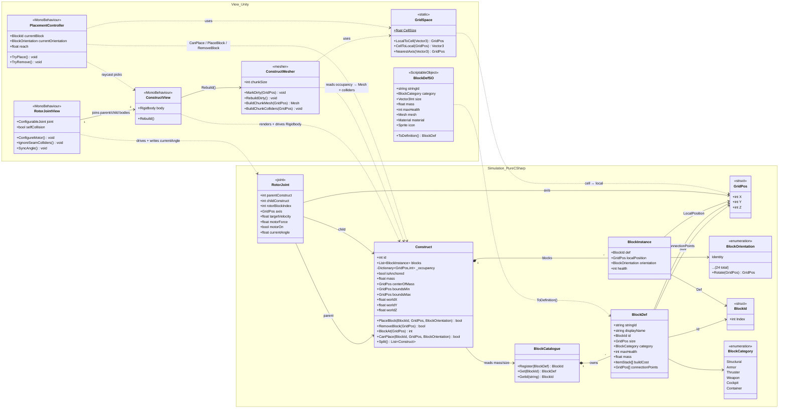

## Rotor joints (subgrids)

- A rotor links two constructs: the base-side blocks are the **parent**; everything past the rotor head is a **child** construct that pivots on the rotor axis. Assemblies form a **tree** of constructs joined by `RotorJoint`s (arbitrary depth — cranes chain several).
- **Rotation model:** blocks keep their discrete 90° `orientation` *within their own construct*; the smooth angle lives on the joint (`currentAngle`, a float). World pose = `parent ∘ jointRotation(θ) ∘ localBlockOrientation` — only the local term is grid-snapped.
- **Motion + self-collision are physics-driven (option A).** Each construct is its own `Rigidbody`; `RotorJointView` owns a Unity `ConfigurableJoint` motor driven from the sim's `targetVelocity`/`motorForce`, and writes `currentAngle` back (`SyncAngle`). `selfCollision` is **on**, so the arm can't pass through the base — with the overlapping rotor-seam colliders selectively ignored (`IgnoreSeamColliders`) to keep the joint stable.
- **No angle limits** — rotors free-spin a full 360°; self-intersection is stopped by physics collision, not by clamping (hence no min/max fields on `RotorJoint`).

## Rendering / meshing

- **Principle:** the sim owns block data; a View-side `ConstructMesher` reads a `Construct`'s occupancy and generates the combined mesh + colliders (pattern #3, "geometry is view, data is sim"). One mesh per construct/chunk — never a GameObject per block. `ConstructView.Rebuild()` drives it; the sim never sees a `Mesh`.
- **Hidden-face culling (baseline):** emit a block face only when the neighbouring cell doesn't occlude it, so interior faces collapse away. Each `BlockDef` carries a 6-bit **occlusion mask** (which faces are full opaque squares); a face is culled only if the neighbour's facing side fully occludes — keeping it correct next to slopes/machines.
- **Two render paths** (blocks aren't all cubes, unlike Minecraft):
  - *Procedural* full-cube armor/structural blocks → generated faces, culled, optionally greedy-merged — the bulk hull.
  - *Authored-mesh* blocks (thrusters, cockpits, machines, sloped armor) → `BlockDefSO.mesh` baked into the combined mesh at the block's cell + orientation; they don't cull neighbours.
- **Greedy meshing (optional):** merge coplanar, same-material faces into larger quads. Add later, only if triangle count hurts — face culling first.
- **Chunking (for "alter"):** split large constructs into chunks (~8³–16³ cells), one submesh each. `PlaceBlock`/`RemoveBlock` marks the affected chunk dirty; only dirty chunks rebuild. Editing a **boundary** cell also dirties the adjacent chunk (its face visibility changed). Small constructs can stay a single mesh.
- **Colliders (separate from the render mesh):** regenerate a **compound of box colliders** (per cell, or greedy-merged boxes) on the construct's Rigidbody — required for the physics-driven rotor self-collision. No concave `MeshCollider` on a dynamic body.
- **Materials:** atlas the hull block textures into one material (UV offsets) for a single draw call; per-material submeshes otherwise.
- **Performance:** occupancy stored as blittable arrays makes the mesher a good Burst-job candidate later.

## Placement / interaction

- **All View-side.** The raycast, colliders, and transform math live in the view; the sim only receives the resulting `GridPos` via `Construct.PlaceBlock`/`RemoveBlock` (spatial input the sim needs is a plain value the view computes).
- **Raycast → construct.** Cast from the camera; `hit.collider.GetComponentInParent<ConstructView>()` gives the specific construct — pointing at a subgrid (crane arm) targets that arm's grid, not the base.
- **Face = hit normal.** No per-face colliders; `RaycastHit.normal` identifies the face being pointed at.
- **World → local grid** (so any rotor/ship rotation is handled automatically — the local grid is always axis-aligned):
  - `localPoint = t.InverseTransformPoint(hit.point)`
  - `localNormal = t.InverseTransformDirection(hit.normal)` → snap to nearest axis (`NearestAxis`) to clean float error
  - `hitCell = LocalToCell(localPoint − localNormal · 0.5·cellSize)` (step inward, floor)
  - `placeCell = hitCell + faceDir` (empty neighbour on that face); removal uses `hitCell`
- **Derive the cell from `hit.point`, not the collider** — greedy-merged box colliders (one box spanning many cells) still resolve the correct cell.
- **One shared mapping.** `LocalToCell`/`CellToLocal` (and the cell convention, e.g. cell `(i,j,k)` = local box `[i·cs, (i+1)·cs)`) must be the *same* helper the mesher and collider-gen use, or placement drifts from the geometry.
- **Preview/ghost.** Render a translucent block at `CellToLocal(placeCell)` in the construct's space before confirming, gated on `Construct.CanPlace(...)`.
- **Alternative:** a DDA voxel-raycast (Amanatides–Woo) in the construct's local grid returns the first solid cell + entered face without colliders; still needs a broad phase to pick the construct.