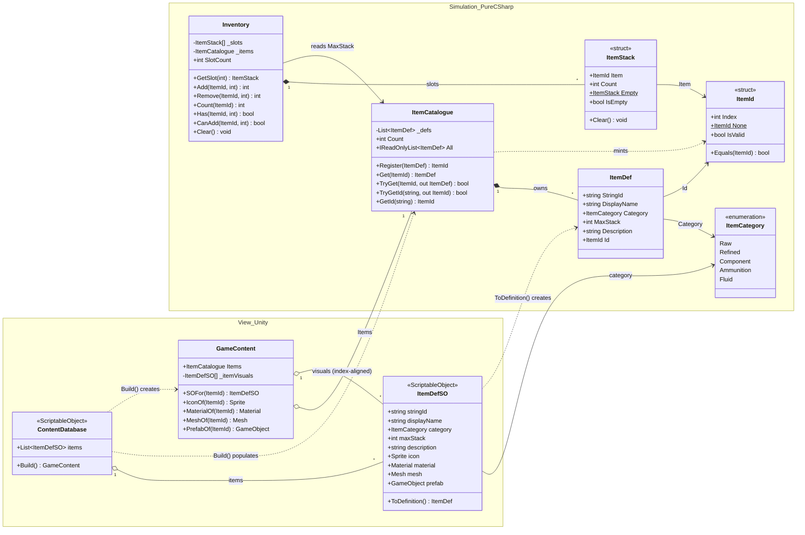

```mermaid
classDiagram
    direction LR

    namespace Simulation_PureCSharp {
        class ItemId {
            <<struct>>
            +int Index
            +ItemId None$
            +bool IsValid
            +Equals(ItemId) bool
        }
        class ItemCategory {
            <<enumeration>>
            Raw
            Refined
            Component
            Ammunition
            Fluid
        }
        class ItemDef {
            +string StringId
            +string DisplayName
            +ItemCategory Category
            +int MaxStack
            +string Description
            +ItemId Id
        }
        class ItemStack {
            <<struct>>
            +ItemId Item
            +int Count
            +ItemStack Empty$
            +bool IsEmpty
            +Clear() void
        }
        class ItemCatalogue {
            -List~ItemDef~ _defs
            +int Count
            +IReadOnlyList~ItemDef~ All
            +Register(ItemDef) ItemId
            +Get(ItemId) ItemDef
            +TryGet(ItemId, out ItemDef) bool
            +TryGetId(string, out ItemId) bool
            +GetId(string) ItemId
        }
        class Inventory {
            -ItemStack[] _slots
            -ItemCatalogue _items
            +int SlotCount
            +GetSlot(int) ItemStack
            +Add(ItemId, int) int
            +Remove(ItemId, int) int
            +Count(ItemId) int
            +Has(ItemId, int) bool
            +CanAdd(ItemId, int) bool
            +Clear() void
        }
    }

    namespace View_Unity {
        class ItemDefSO {
            <<ScriptableObject>>
            +string stringId
            +string displayName
            +ItemCategory category
            +int maxStack
            +string description
            +Sprite icon
            +Material material
            +Mesh mesh
            +GameObject prefab
            +ToDefinition() ItemDef
        }
        class GameContent {
            +ItemCatalogue Items
            -ItemDefSO[] _itemVisuals
            +SOFor(ItemId) ItemDefSO
            +IconOf(ItemId) Sprite
            +MaterialOf(ItemId) Material
            +MeshOf(ItemId) Mesh
            +PrefabOf(ItemId) GameObject
        }
        class ContentDatabase {
            <<ScriptableObject>>
            +List~ItemDefSO~ items
            +Build() GameContent
        }
    }

    ItemDef --> ItemCategory : Category
    ItemDef --> ItemId : Id
    ItemStack --> ItemId : Item
    ItemCatalogue "1" *-- "*" ItemDef : owns
    ItemCatalogue ..> ItemId : mints
    Inventory "1" *-- "*" ItemStack : slots
    Inventory --> ItemCatalogue : reads MaxStack

    ItemDefSO --> ItemCategory : category
    ItemDefSO ..> ItemDef : ToDefinition() creates
    ContentDatabase "1" o-- "*" ItemDefSO : items
    ContentDatabase ..> ItemCatalogue : Build() populates
    ContentDatabase ..> GameContent : Build() creates
    GameContent o-- "1" ItemCatalogue : Items
    GameContent "1" o-- "*" ItemDefSO : visuals (index-aligned)
```